

<b style="">SFND
RADAR Target Generation and Detection<o:p></o:p></b>

In this project, RADAR will be used to
detect target by filtering the noise. &nbsp;This can be achieved using following steps<o:p></o:p>

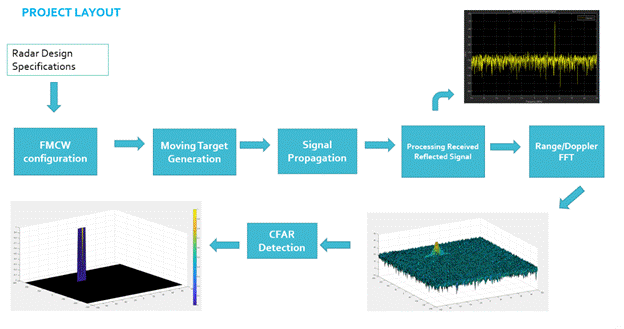<o:p></o:p>

<ol start="1" type="1">
 <li class="MsoNormal" style="color: rgb(36, 41, 46); line-height: normal; background-color: white; background-image: initial;">Configure the FMCW waveform
     based on the system requirements.<o:p></o:p></li>
 <li class="MsoNormal" style="color: rgb(36, 41, 46); margin-top: 3pt; line-height: normal; background-color: white; background-image: initial;">Define the range and velocity
     of target and simulate its displacement.<o:p></o:p></li>
 <li class="MsoNormal" style="color: rgb(36, 41, 46); margin-top: 3pt; line-height: normal; background-color: white; background-image: initial;">For the same simulation loop
     process the transmit and receive signal to determine the beat signal.<o:p></o:p></li>
 <li class="MsoNormal" style="color: rgb(36, 41, 46); margin-top: 3pt; line-height: normal; background-color: white; background-image: initial;">Perform Range FFT on the
     received signal to determine the Range.<o:p></o:p></li>
 <li class="MsoNormal" style="color: rgb(36, 41, 46); margin-top: 3pt; line-height: normal; background-color: white; background-image: initial;">Towards the end, perform the
     CFAR processing on the output of 2nd FFT to display the target.<o:p></o:p></li>
</ol>

<h1>RADAR Specifications:<o:p></o:p></h1>

<ul type="disc">
 <li class="MsoNormal" style="color: rgb(36, 41, 46); line-height: normal; background-color: white; background-image: initial;">Frequency of operation = 77GHz<o:p></o:p></li>
 <li class="MsoNormal" style="color: rgb(36, 41, 46); margin-top: 3pt; line-height: normal; background-color: white; background-image: initial;">Max Range = 200m<o:p></o:p></li>
 <li class="MsoNormal" style="color: rgb(36, 41, 46); margin-top: 3pt; line-height: normal; background-color: white; background-image: initial;">Range Resolution = 1 m<o:p></o:p></li>
 <li class="MsoNormal" style="color: rgb(36, 41, 46); margin-top: 3pt; line-height: normal; background-color: white; background-image: initial;">Max Velocity = 100 m/s<o:p></o:p></li>
</ul>

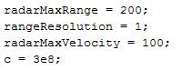<o:p></o:p>

<h2>User Defined Range and
Velocity of target:<o:p></o:p></h2>

<ul type="disc">
 <li class="MsoNormal" style="color: rgb(36, 41, 46); line-height: normal; background-color: white; background-image: initial;">Defined Velocity and Range of
     Target<o:p></o:p></li>
</ul>

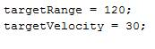<b style=""><u><o:p></o:p></u></b>

<h2>FMCW Waveform Design:<o:p></o:p></h2>

<ul type="disc">
 <li class="MsoNormal" style="line-height: normal; background-color: white; background-image: initial;">Designed FMCW
     waveform using the given system requirements. Calculated Bandwidth (B),
     Chirp Time (Tchirp) and Slope (slope).<o:p></o:p></li>
</ul>

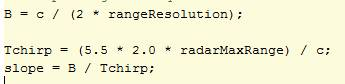<o:p></o:p>

Got slope value as 2.045e+13.<o:p></o:p>

<ul type="disc">
 <li class="MsoNormal" style="color: rgb(36, 41, 46); line-height: normal; background-color: white; background-image: initial;">Defined operating carrier
     frequency of Radar as per specification<o:p></o:p></li>
</ul>

<o:p></o:p>

<ul type="disc">
 <li class="MsoNormal" style="color: rgb(36, 41, 46); line-height: normal; background-color: white; background-image: initial;">Number of Chirps value is set as
     128 in one sequence as its ideal to have 2^ value for the ease of running
     FFT for Doppler Estimation.&nbsp; Defined
     number of samples on each chirp as 1024.<o:p></o:p></li>
</ul>

<o:p></o:p>

<ul type="disc">
 <li class="MsoNormal" style="color: rgb(36, 41, 46); line-height: normal; background-color: white; background-image: initial;">Timestamp for running the
     displacement scenario for every sample on each chirp<o:p></o:p></li>
</ul>

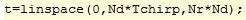<o:p></o:p>

<ul type="disc">
 <li class="MsoNormal" style="color: rgb(36, 41, 46); line-height: normal; background-color: white; background-image: initial;">Defining the vectors for Tx, Rx
     and Mix based on the total samples input.<o:p></o:p></li>
</ul>

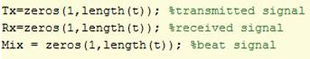<o:p></o:p>

<o:p>&nbsp;</o:p>

<ul type="disc">
 <li class="MsoNormal" style="color: rgb(36, 41, 46); line-height: normal; background-color: white; background-image: initial;">Similar vectors for
     range_covered and time delay.<o:p></o:p></li>
</ul>

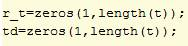<o:p></o:p>

<h2>Signal generation and
Moving Target simulation:<o:p></o:p></h2>

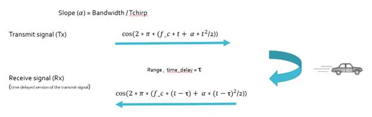<o:p></o:p>

<ul type="disc">
 <li class="MsoNormal" style="color: rgb(36, 41, 46); line-height: normal; background-color: white; background-image: initial;">Generated Signal and simulated
     the moving target which is defined initially. Updated transmitted and
     received signal values based on the formulae.<o:p></o:p></li>
</ul>

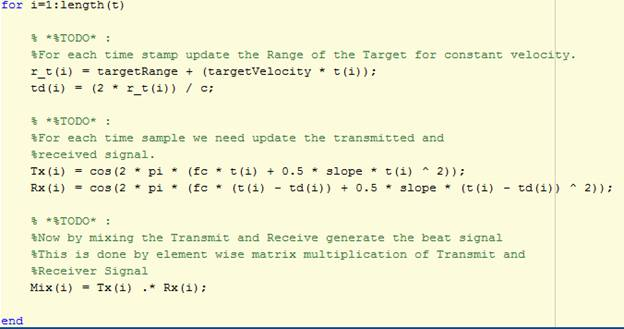<o:p></o:p>

<h2>RANGE MEASUREMENT:<o:p></o:p></h2>

<ul type="disc">
 <li class="MsoNormal" style="color: rgb(36, 41, 46); line-height: normal; background-color: white; background-image: initial;">Reshape the vector into Nr * Nd
     array<o:p></o:p></li>
</ul>

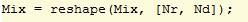<o:p></o:p>

<ul type="disc">
 <li class="MsoNormal" style="color: rgb(36, 41, 46); line-height: normal; background-color: white; background-image: initial;">Run the FFT on the beat signal
     along the range bins dimension (Nr) <o:p></o:p></li>
</ul>

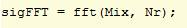<o:p></o:p>

<ul type="disc">
 <li class="MsoNormal" style="color: rgb(36, 41, 46); line-height: normal; background-color: white; background-image: initial;">Take the absolute value of FFT
     output and normalize<o:p></o:p></li>
</ul>

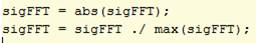<o:p></o:p>

<ul type="disc">
 <li class="MsoNormal" style="color: rgb(36, 41, 46); line-height: normal; background-color: white; background-image: initial;">Output of FFT is double sided
     signal, but we are interested in only one side of the spectrum. Hence we
     throw out half of the samples.<o:p></o:p></li>
</ul>

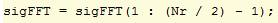<o:p></o:p>

<ul type="disc">
 <li class="MsoNormal" style="color: rgb(36, 41, 46); line-height: normal; background-color: white; background-image: initial;">Plotting of FFT Output<o:p></o:p></li>
</ul>

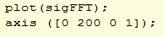<o:p></o:p>

<ul type="disc">
 <li class="MsoNormal" style="color: rgb(36, 41, 46); line-height: normal; background-color: white; background-image: initial;">Simulation Result is as follows<b style=""><u>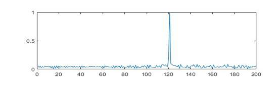</u></b><b style=""><u><o:p></o:p></u></b></li>
</ul>

<h2>RANGE DOPPLER RESPONSE:<o:p></o:p></h2>

<h3>Range Doppler Map
Generation:<o:p></o:p></h3>

<ul type="disc">
 <li class="MsoNormal" style="color: rgb(36, 41, 46); line-height: normal; background-color: white; background-image: initial;">Output of 2D FFT is an image
     that has response in the range and Doppler FFT bins. So, it is important
     to convert the axis from bin sizes to range and Doppler based on their Max
     values.<o:p></o:p></li>
</ul>

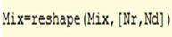<o:p></o:p>

<ul type="disc">
 <li class="MsoNormal" style="color: rgb(36, 41, 46); line-height: normal; background-color: white; background-image: initial;">2D FFT using the FFT size
     dimensions for both <o:p></o:p></li>
</ul>

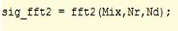<o:p></o:p>

<ul type="disc">
 <li class="MsoNormal" style="color: rgb(36, 41, 46); line-height: normal; background-color: white; background-image: initial;">Taking just one side of signal
     from Range dimension<o:p></o:p></li>
</ul>

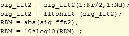<o:p></o:p>

<ul type="disc">
 <li class="MsoNormal" style="color: rgb(36, 41, 46); line-height: normal; background-color: white; background-image: initial;">Use the surf function to plot
     the output of 2DFFT and to show axis in both dimensions<o:p></o:p></li>
</ul>

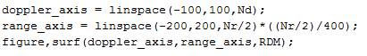<o:p></o:p>

<ul type="disc">
 <li class="MsoNormal" style="line-height: normal; background-color: white; background-image: initial;">Output of 2D FFT
     is as follows<o:p></o:p></li>
</ul>

<b style=""><u>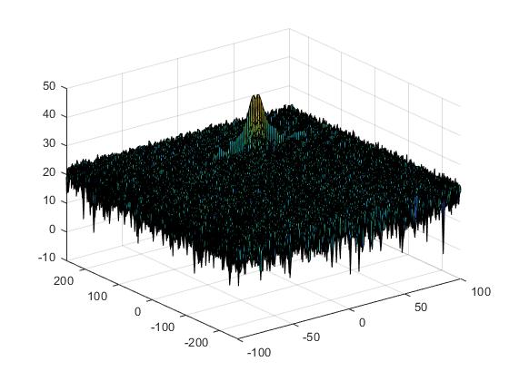</u></b><b style=""><u><o:p></o:p></u></b>

<h2>CFAR implementation:</h2>

<ul type="disc">
 <li class="MsoNormal" style="color: rgb(36, 41, 46); line-height: normal; background-color: white; background-image: initial;">Determined the number of
     training cells for each dimension Tr and Td. Similarly, picked the number
     for guard cells Gr and Gd.<o:p></o:p></li>
 <li class="MsoNormal" style="color: rgb(36, 41, 46); line-height: normal; background-color: white; background-image: initial;">Defined Grid Size and Train
     Cells based on both Leading and Trailing cells. So, multiplied by 2.<o:p></o:p></li>
</ul>

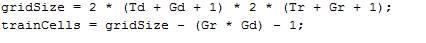<o:p></o:p>

<ul type="disc">
 <li class="MsoNormal" style="color: rgb(36, 41, 46); line-height: normal; background-color: white; background-image: initial;">Designed a loop such that it
     slides the CUT across Range Doppler Map<o:p></o:p></li>
 <li class="MsoNormal" style="color: rgb(36, 41, 46); line-height: normal; background-color: white; background-image: initial;">Slide the cell under test (CUT)
     across the complete cell matrix.<o:p></o:p></li>
 <li class="MsoNormal" style="color: rgb(36, 41, 46); line-height: normal; background-color: white; background-image: initial;">For every iteration sum the
     signal level within all the training cells. To sum convert the value from
     logarithmic to linear using db2pow function.<o:p></o:p></li>
 <li class="MsoNormal" style="color: rgb(36, 41, 46); line-height: normal; background-color: white; background-image: initial;">Average the summed values for
     all of the training cells used. After averaging convert it back to
     logarithmic using pow2db.<o:p></o:p></li>
 <li class="MsoNormal" style="color: rgb(36, 41, 46); line-height: normal; background-color: white; background-image: initial;">Further added the offset to it
     to determine the threshold.<o:p></o:p></li>
 <li class="MsoNormal" style="color: rgb(36, 41, 46); line-height: normal; background-color: white; background-image: initial;">Compare the signal under CUT
     against this threshold.<o:p></o:p></li>
 <li class="MsoNormal" style="color: rgb(36, 41, 46); line-height: normal; background-color: white; background-image: initial;">If the CUT level &gt; threshold
     assign it a value of 1, else equate it to 0.<o:p></o:p></li>
</ul>

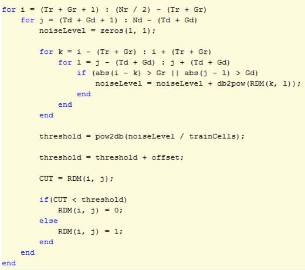

<h2>Selection of Training, Guard cells and offset.</h2>

<ul type="disc">
 <li class="MsoNormal" style="color: rgb(36, 41, 46); line-height: normal; background-color: white; background-image: initial;">Number of Training cells in Range
     dimension (Tr) = 10<o:p></o:p></li>
 <li class="MsoNormal" style="color: rgb(36, 41, 46); line-height: normal; background-color: white; background-image: initial;">Number of Training cells in Doppler
     dimension (Td) = 8<o:p></o:p></li>
</ul>

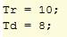<o:p></o:p>

<ul type="disc">
 <li class="MsoNormal" style="color: rgb(36, 41, 46); line-height: normal; background-color: white; background-image: initial;">Number of Guard cells in Range
     dimension (Gr) = 4<o:p></o:p></li>
 <li class="MsoNormal" style="color: rgb(36, 41, 46); line-height: normal; background-color: white; background-image: initial;">Number of Guard cells in Doppler
     dimension (Gd) = 4<o:p></o:p></li>
</ul>

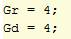<o:p></o:p>

<ul type="disc">
 <li class="MsoNormal" style="color: rgb(36, 41, 46); line-height: normal; background-color: white; background-image: initial;">Offset the threshold by SNR
     value in dB. Offset = 1.4.<o:p></o:p></li>
</ul>

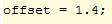

<ul type="disc">
 <li class="MsoNormal" style="color: rgb(36, 41, 46); line-height: normal; background-color: white; background-image: initial;">These values are chosen by
     observing iteratively..<o:p></o:p></li>
</ul>

<h2>Steps taken to suppress the Non- Thresholded
cells at the edges:<o:p></o:p></h2>

<ul type="disc">
 <li class="MsoNormal" style="color: rgb(36, 41, 46); line-height: normal; background-color: white; background-image: initial;">The process above will generate
     a thresholded block, which is smaller than the Range Doppler Map (RDM) as
     the Cell Under Test (CUT) cannot be located at the edges of matrix.So, few
     cells will not be thresholded. To keep the map size same set those values
     to 0. <o:p></o:p></li>
 <li class="MsoNormal" style="color: rgb(36, 41, 46); line-height: normal; background-color: white; background-image: initial;">So, locating the indices where
     threshold is not applied and setting the value to 0. <o:p></o:p></li>
 <li class="MsoNormal" style="color: rgb(36, 41, 46); line-height: normal; background-color: white; background-image: initial;">If CUT is less than threshold,
     we have set value to zero and else 1. So, checking the indices where value
     is neither 0 nor 1 and setting them 0 with following statement<o:p></o:p></li>
</ul>

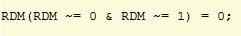<o:p></o:p>

<h2>CFAR Output:</h2>

<b style=""><u>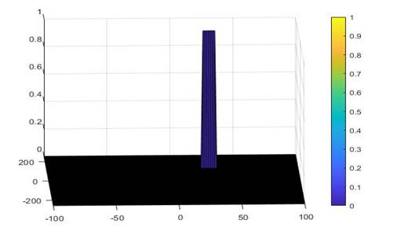</u></b><b style=""><u><o:p></o:p></u></b>

